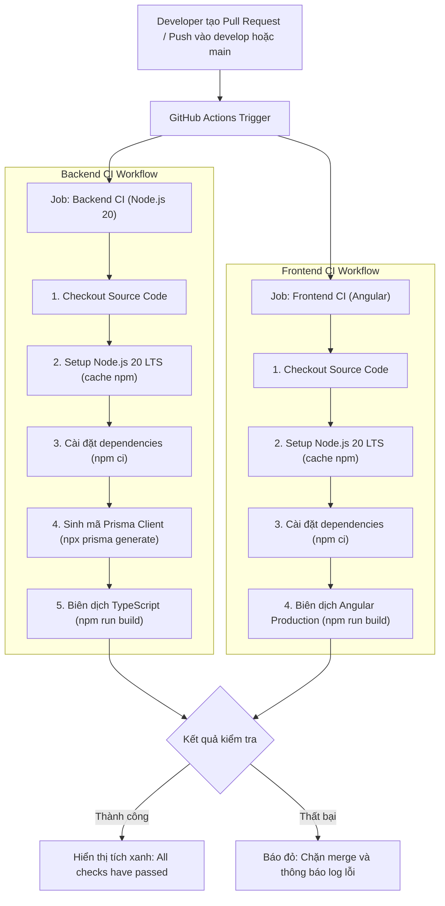

# BÁO CÁO THIẾT LẬP HỆ THỐNG CI (CONTINUOUS INTEGRATION)
## TỰ ĐỘNG HÓA KIỂM THỬ VÀ XÂY DỰNG VỚI GITHUB ACTIONS

* **Dự án:** Hệ thống Quản lý Ký túc xá tích hợp AI (Dormitory Management System)
* **Sinh viên thực hiện:** Phạm Thị Ngọc Ánh - MSV: DTC235200050 (CNTT K22H)
* **Đơn vị thực tập:** Công ty Cổ phần Công nghệ TFL
* **Cán bộ hướng dẫn:** Lê Anh Duy

---

### 1. Mục tiêu triển khai CI Pipeline
Trong phát triển phần mềm hiện đại tại các doanh nghiệp công nghệ, **CI (Continuous Integration)** đóng vai trò sống còn trong việc kiểm soát chất lượng mã nguồn:
- **Tự động hóa kiểm tra:** Mỗi khi có Pull Request được tạo từ các nhánh tính năng (`task/KTX-...`) vào nhánh `develop` hoặc `main`, máy ảo GitHub Actions sẽ tự động kích hoạt quá trình build kiểm thử.
- **Phát hiện lỗi sớm (Fail-fast):** Nếu có lỗi cú pháp TypeScript, thiếu thư viện phụ thuộc, hoặc xung đột schema Prisma, CI sẽ báo đỏ và ngăn không cho merge code lỗi vào nhánh chính.
- **Dấu tích xanh (Green Checkmark):** Minh chứng cho chất lượng code đã vượt qua toàn bộ các bài kiểm tra tự động trước khi người quản trị (Reviewer) duyệt PR.

---

### 2. Cấu trúc Pipeline (`.github/workflows/ci.yml`)

Quy trình CI bao gồm 2 jobs chạy song song độc lập trên môi trường `ubuntu-latest`:

---

### 3. Ý nghĩa thực tiễn đối với đề tài thực tập
- **Tính chuyên nghiệp cao:** Đưa dự án sinh viên tiệm cận quy chuẩn DevOps công nghiệp đang áp dụng tại Công ty CP Công nghệ TFL.
- **Tiền đề cho giai đoạn CD (Continuous Deployment):** Khi kết thúc EPIC B & C, pipeline này sẽ được mở rộng thêm job CD để tự động deploy bản build lên Cloud Server (Render / Vercel / VPS).
