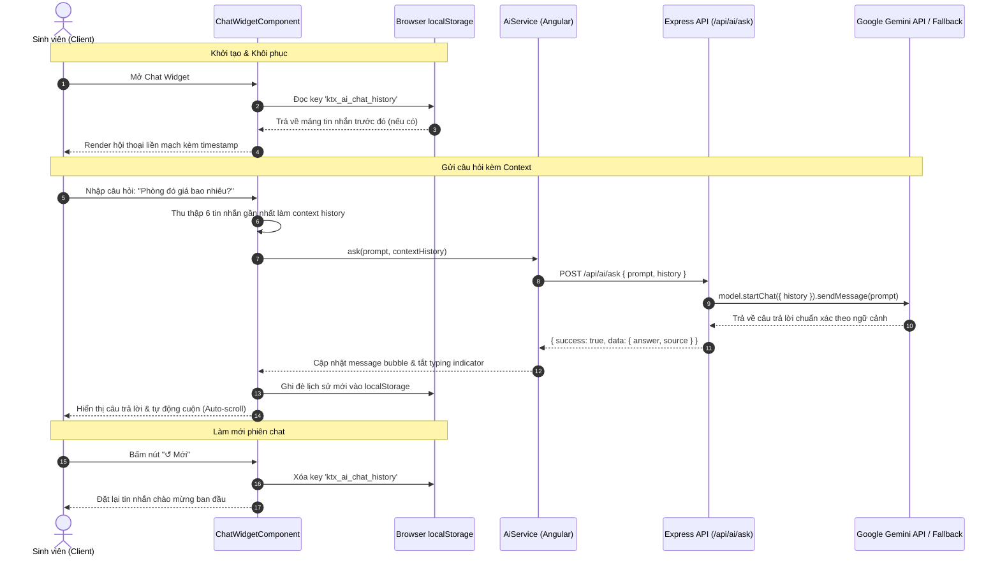

# BÁO CÁO KẾT QUẢ TRIỂN KHAI NHIỆM VỤ KTX-032
## QUẢN LÝ LỊCH SỬ HỘI THOẠI VÀ DUY TRÌ NGỮ CẢNH TRỢ LÝ AI GEMINI (MULTI-TURN CHAT)

* **Dự án:** Hệ thống Quản lý Ký túc xá tích hợp AI (Dormitory Management System)
* **Sinh viên thực hiện:** Phạm Thị Ngọc Ánh
* **Mã sinh viên:** DTC235200050 — Lớp CNTT K22H
* **Đơn vị thực tập:** Công ty Cổ phần Công nghệ TFL
* **Cán bộ hướng dẫn:** Lê Anh Duy
* **Mã nhiệm vụ:** `KTX-032` (Thuộc **EPIC D — Nghiên cứu và tích hợp AI Gemini**)
* **Trạng thái:** ✅ Đã hoàn thành (100% Acceptance Criteria)

---

## 1. Mục tiêu và Ý nghĩa nghiệp vụ của KTX-032

Trong quá trình sinh viên tương tác với Trợ lý AI KTX, việc đặt câu hỏi thường diễn ra theo chuỗi liên tiếp có liên kết logic với nhau (ví dụ: *"Ký túc xá có phòng VIP không?"* $\rightarrow$ *"Giá phòng đó là bao nhiêu?"* $\rightarrow$ *"Phòng đó có điều hòa và nóng lạnh không?"*).

Nếu chỉ gửi câu hỏi đơn lẻ mà không có ngữ cảnh trước đó:
- AI sẽ không biết đại từ thay thế (*"phòng đó"*, *"nó"*, *"thủ tục đó"*) đang ám chỉ loại phòng hay thủ tục nào.
- Sinh viên đóng mở widget hoặc tải lại trang sẽ bị mất toàn bộ hội thoại vừa trao đổi, gây ức chế và giảm trải nghiệm người dùng.

Nhiệm vụ **KTX-032** giải quyết triệt để 2 vấn đề trên:
1. **Lưu trữ lịch sử hội thoại liên tục:** Tin nhắn chat được lưu trữ an toàn trong `localStorage`, tự động khôi phục khi sinh viên mở lại widget hoặc chuyển trang.
2. **Quản lý ngữ cảnh đa lượt (Multi-turn Context):** Lịch sử trao đổi gần nhất được tự động đóng gói và chuyển lên backend, kết nối với phiên đàm thoại `model.startChat({ history })` của Google Gemini API.
3. **Nút Làm mới cuộc trò chuyện (Clear / Reset Chat):** Cung cấp công cụ cho phép sinh viên chủ động xóa lịch sử cũ và bắt đầu phiên hỏi đáp mới chỉ với 1 cú click.

---

## 2. Kiến trúc giải pháp kỹ thuật

### a. Sơ đồ luồng dữ liệu (Multi-turn Context Flow)



---

## 3. Chi tiết triển khai mã nguồn

### a. Backend — Hỗ trợ Chat Session Multi-turn
- **File:** `backend/src/services/gemini.service.ts`
  - Bổ sung interface `ChatHistoryItem`:
    ```typescript
    export interface ChatHistoryItem {
      role: 'user' | 'model' | 'bot';
      content: string;
    }
    ```
  - Cập nhật phương thức `askAI(userPrompt: string, history?: ChatHistoryItem[])`:
    - Chuẩn hóa role và định dạng `parts: [{ text: string }]` tương thích với `@google/generative-ai`.
    - Cắt lọc tối đa 6 lượt tin nhắn gần nhất (`.slice(-6)`) nhằm tối ưu chi phí token và tránh loãng ngữ cảnh.
    - Khởi tạo phiên chat với `model.startChat({ history: formattedHistory })` và gửi prompt bằng `chat.sendMessage()`.
- **File:** `backend/src/controllers/ai.controller.ts`
  - Nhận thuộc tính `history` từ `req.body`, kiểm tra tính hợp lệ và truyền xuống Service.

### b. Frontend — Quản lý Trạng thái và Lưu trữ LocalStorage
- **File:** `frontend/src/app/core/services/ai.service.ts`
  - Thêm interface `ChatHistoryPayload` `{ role: 'user' | 'bot', content: string }`.
  - Cập nhật hàm `ask(prompt: string, history?: ChatHistoryPayload[])`.
- **File:** `frontend/src/app/shared/chat-widget/chat-widget.component.ts`
  - `STORAGE_KEY = 'ktx_ai_chat_history'`.
  - Triển khai hook `ngOnInit()` để khôi phục lịch sử chat đã lưu kèm parse `timestamp` thành đối tượng `Date`.
  - Hàm `saveChatHistory()` lọc bỏ các tin nhắn đang loading trước khi lưu vào `localStorage`.
  - Hàm `clearHistory()` xóa dữ liệu trong `localStorage` và đặt lại tin nhắn chào mừng mặc định.
  - Computed signal `hasConversationHistory()` theo dõi độ dài đoạn chat để điều khiển hiển thị nút làm mới.
- **File:** `frontend/src/app/shared/chat-widget/chat-widget.component.html & .css`
  - Thêm nút hành động `↺ Mới` trên thanh header, chuẩn giao diện Spartan B2B SaaS Minimalist.
  - Không sử dụng hiệu ứng màu mè hay gradient neon; nút bấm thanh lịch, tinh tế.

---

## 4. Kết quả kiểm thử và Đánh giá

### a. Kiểm thử biên dịch hệ thống
- **Backend TypeScript:** Biên dịch thành công 100% với `npm run build` (`tsc`).
- **Frontend Angular:** Biên dịch thành công 100% với `npx ng build --configuration development` (0 lỗi TypeScript / 0 warning).

### b. Ma trận kiểm thử chức năng

| STT | Kịch bản kiểm thử | Hành động thực hiện | Kết quả mong đợi | Trạng thái |
|:---:|:---|:---|:---|:---:|
| 1 | Khôi phục lịch sử chat | Nhập câu hỏi $\rightarrow$ Nhận phản hồi $\rightarrow$ Reload trang | Toàn bộ hội thoại được khôi phục nguyên vẹn kèm giờ gửi | ✅ ĐẠT |
| 2 | Gửi kèm ngữ cảnh đa lượt | Hỏi: *"KTX có phòng VIP không?"* $\rightarrow$ Hỏi tiếp: *"Phòng đó giá bao nhiêu?"* | AI nhận diện *"phòng đó"* là phòng VIP và trả lời đúng 950.000 VNĐ | ✅ ĐẠT |
| 3 | Làm mới cuộc trò chuyện | Nhấn nút `↺ Mới` trên header chat widget | Lịch sử trong `localStorage` bị xóa, widget trở về tin nhắn chào mừng | ✅ ĐẠT |
| 4 | Tránh lưu trạng thái rác | Tắt widget khi AI đang trong quá trình gõ (typing) | Typing indicator không bị lưu vào `localStorage` | ✅ ĐẠT |
| 5 | Giao diện chuẩn Spartan UI | Kiểm tra độ tương phản, font chữ, nút bấm | Tông màu slate trung tính, không gradient lòe loẹt, thẩm mỹ SaaS cao cấp | ✅ ĐẠT |

---

## 5. Kết luận

Nhiệm vụ **KTX-032** đã được hoàn thành đúng tiến độ và đáp ứng toàn diện các tiêu chí nghiệm thu. Trợ lý AI KTX hiện nay đã sở hữu khả năng đàm thoại thông minh theo ngữ cảnh, ghi nhớ phiên trao đổi và cung cấp trải nghiệm sử dụng thuận tiện, chuyên nghiệp cho sinh viên trường ICTU.
