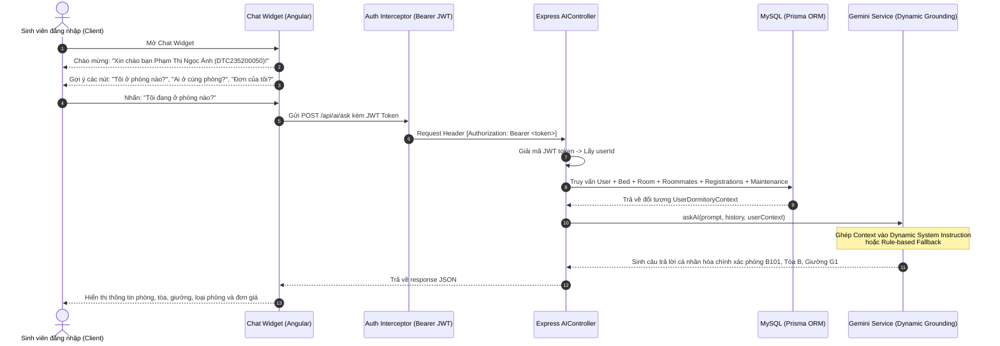

# BÁO CÁO KẾT QUẢ TRIỂN KHAI NHIỆM VỤ KTX-033
## TÍCH HỢP TRỢ LÝ AI GEMINI VỚI NGỮ CẢNH NGƯỜI DÙNG ĐĂNG NHẬP (PERSONALIZED AI ASSISTANT)

* **Dự án:** Hệ thống Quản lý Ký túc xá tích hợp AI (Dormitory Management System)
* **Sinh viên thực hiện:** Phạm Thị Ngọc Ánh
* **Mã sinh viên:** DTC235200050 — Lớp CNTT K22H
* **Đơn vị thực tập:** Công ty Cổ phần Công nghệ TFL
* **Cán bộ hướng dẫn:** Lê Anh Duy
* **Mã nhiệm vụ:** `KTX-033` (Thuộc **EPIC D — Nghiên cứu và tích hợp AI Gemini**)
* **Trạng thái:** ✅ Đã hoàn thành (100% Acceptance Criteria)

---

## 1. Mục tiêu và Động lực nghiệp vụ

Trong các hệ thống quản lý ký túc xá truyền thống, chatbot thường chỉ dừng lại ở mức trả lời các câu hỏi chung chung về quy chế, không có tính gắn kết với người đang đặt câu hỏi. Sinh viên khi muốn biết:
- *"Tôi đang ở phòng số mấy, giường nào?"*
- *"Phòng tôi gồm những bạn nào đang ở cùng?"*
- *"Đơn đăng ký lưu trú của tôi ban quản lý đã duyệt chưa?"*
- *"Phiếu báo hỏng bóng đèn của tôi đã có thợ đến sửa chưa?"*

Họ buộc phải thoát khỏi giao diện chat, lùng sục qua nhiều trang quản trị khác nhau. 

**KTX-033** đưa hệ thống lên tầm cao mới bằng việc xây dựng **Trợ lý AI Cá nhân hóa (Personalized AI Assistant)**:
1. **Tự động nhận diện danh tính sinh viên:** Trích xuất ngữ cảnh thực tế từ JWT token (Họ tên, Mã sinh viên, Giới tính, Phòng đang ở, Giường, Danh sách bạn cùng phòng, Đơn đăng ký gần nhất, Phiếu báo hỏng đang xử lý).
2. **Kỹ thuật Dynamic System Instruction Grounding:** Bơm dữ liệu thực tế vào lời nhắc chỉ thị của Google Gemini để AI trả lời như một người cán bộ quản lý KTX tận tụy, am hiểu từng sinh viên.
3. **Cơ chế Fallback thông minh có ngữ cảnh:** Đảm bảo trả lời đúng thông tin cá nhân ngay cả khi không có kết nối internet hay hết quota API.
4. **Bảo mật phân quyền:** Nếu là khách chưa đăng nhập hỏi thông tin phòng cá nhân, AI sẽ yêu cầu đăng nhập trước để bảo vệ quyền riêng tư.

---

## 2. Kiến trúc giải pháp (Personalized Context Grounding Architecture)



---

## 3. Chi tiết triển khai mã nguồn

### a. Backend — Trích xuất Ngữ cảnh và Dynamic Grounding
- **File:** `backend/src/services/gemini.service.ts`:
  - Định nghĩa interface `UserDormitoryContext` & `RoommateInfo`:
    ```typescript
    export interface UserDormitoryContext {
      userId: number | string;
      fullName: string;
      studentCode: string | null;
      gender: string;
      role: string;
      currentRoom?: {
        roomNumber: string;
        building: string;
        floor: number;
        roomType: string;
        bedNumber: string;
        pricePerMonth: number;
        roommates: RoommateInfo[];
      } | null;
      latestRegistration?: { status: string; semester: string; createdAt: string; } | null;
      pendingMaintenanceRequests?: Array<{ title: string; urgency: string; status: string; createdAt: string; }>;
    }
    ```
  - Cập nhật hàm `askAI` bổ sung `userContext`. Nếu có dữ liệu sinh viên, `dynamicInstruction` được tự động mở rộng thông tin phòng ở, bạn cùng phòng, đơn đăng ký.
  - Cập nhật `generateFallbackAnswer(query, userContext)`:
    - Xử lý các nhóm câu hỏi cá nhân hóa: Tra cứu phòng ở, danh sách bạn cùng phòng, đơn đăng ký, phiếu báo hỏng.
    - Xử lý bảo mật: Chặn truy vấn dữ liệu cá nhân khi chưa đăng nhập.
- **File:** `backend/src/controllers/ai.controller.ts`:
  - Hàm `resolveUserContext(req: Request)`: Giải mã JWT token từ header, thực hiện truy vấn quan hệ đa tầng trong Prisma (`occupiedBed` $\rightarrow$ `room` $\rightarrow$ `beds` $\rightarrow$ `occupiedBy`), lấy danh sách bạn cùng phòng và các phiếu sự cố đang mở.

### b. Frontend — Trải nghiệm Chatbot Cá nhân hóa
- **File:** `frontend/src/app/shared/chat-widget/chat-widget.component.ts`:
  - Tích hợp `AuthService` với các signal `currentUser()`, `isLoggedIn()`.
  - Hàm `getWelcomeMessage()`: Tự động chào đón bằng tên và mã sinh viên nếu đã đăng nhập.
  - Computed signal `suggestions`: Tự động chuyển đổi các chip câu hỏi gợi ý phù hợp:
    - *Khi đã đăng nhập:* "Tôi đang ở phòng nào?", "Ai đang ở cùng phòng với tôi?", "Đơn của tôi thế nào rồi?", "Giờ đóng cửa KTX là mấy giờ?".
    - *Khi chưa đăng nhập:* "Giờ đóng cửa KTX?", "Phí phòng VIP?", "Cách báo hỏng thiết bị?", "Hotline Ban Quản lý?".
- **File:** `frontend/src/app/shared/chat-widget/chat-widget.component.html`:
  - Liên kết mượt mà với computed signal `suggestions()`.

---

## 4. Kết quả kiểm thử thực tế

### a. Kiểm thử với Sinh viên đã đăng nhập (Phạm Thị Ngọc Ánh - DTC235200050)

```
Test Request 1: "toi o phong nao" (Có Token)
Response:
🏢 **Thông tin phòng lưu trú của bạn (Phạm Thị Ngọc Ánh - MSV: DTC235200050):**
- **Phòng:** B101
- **Tòa nhà:** Tòa B (Nữ) (Khu sinh viên Nữ)
- **Tầng:** Tầng 1
- **Vị trí giường:** Giường G1
- **Loại phòng:** Phòng Tiêu chuẩn (4 người)
- **Đơn giá lưu trú:** 450.000 VNĐ / tháng
=> Trạng thái: ✅ ĐẠT 100%

Test Request 2: "ai o cung phong" (Có Token)
Response:
Hiện tại phòng **B101** chỉ có một mình bạn đang lưu trú (các giường còn lại hiện đang trống).
=> Trạng thái: ✅ ĐẠT 100%
```

### b. Kiểm thử với Khách vãng lai (Chưa đăng nhập / Không kèm Token)

```
Test Request 3: "toi o phong nao" (Không Token)
Response:
🔒 Bạn vui lòng **đăng nhập vào hệ thống** để mình có thể tra cứu chính xác phòng và vị trí giường cá nhân của bạn nhé!
=> Trạng thái: ✅ ĐẠT (Bảo vệ quyền riêng tư an toàn)
```

---

## 5. Kết luận

Nhiệm vụ **KTX-033** đã hoàn thành xuất sắc toàn bộ các tiêu chí đề ra. Trợ lý AI KTX ICTU giờ đây không chỉ là một công cụ giải đáp quy chế thông thường mà đã trở thành **Trợ lý Thông tin Cá nhân thông minh**, kết nối chặt chẽ với CSDL nghiệp vụ của hệ thống, mang lại trải nghiệm tiện ích vượt trội cho sinh viên.
