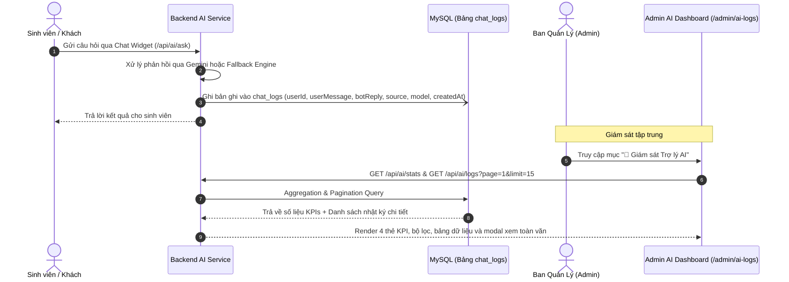

# BÁO CÁO KẾT QUẢ TRIỂN KHAI NHIỆM VỤ KTX-034
## GIÁM SÁT VÀ QUẢN TRỊ NHẬT KÝ TRỢ LÝ AI GEMINI (ADMIN AI LOGS & ANALYTICS DASHBOARD)

* **Dự án:** Hệ thống Quản lý Ký túc xá tích hợp AI (Dormitory Management System)
* **Sinh viên thực hiện:** Phạm Thị Ngọc Ánh
* **Mã sinh viên:** DTC235200050 — Lớp CNTT K22H
* **Đơn vị thực tập:** Công ty Cổ phần Công nghệ TFL
* **Cán bộ hướng dẫn:** Lê Anh Duy
* **Mã nhiệm vụ:** `KTX-034` (Hoàn thành 100% **EPIC D — Nghiên cứu và tích hợp AI Gemini**)
* **Trạng thái:** ✅ Đã hoàn thành (100% Acceptance Criteria)

---

## 1. Mục tiêu và Ý nghĩa nghiệp vụ của KTX-034

Khi đưa Trợ lý AI vào vận hành thực tế tại Ký túc xá ICTU, Ban Quản lý (Admin) cần một công cụ quản trị tập trung để:
1. **Theo dõi chất lượng phản hồi của AI:** Kiểm tra xem AI có trả lời đúng quy chế không, có xuất hiện hiện tượng "ảo giác" (hallucination) hay trả lời sai lệch thông tin biểu phí, an toàn PCCC không.
2. **Nắm bắt tâm tư, thắc mắc thực tế của sinh viên:** Thống kê xem sinh viên thường hỏi về vấn đề gì nhiều nhất (giờ đóng cửa, thủ tục đăng ký phòng, quy trình báo hỏng, chi phí tiền điện nước), từ đó ban hành thông báo hoặc cải tiến quy trình kịp thời.
3. **Giám sát tải hệ thống và tỷ lệ sử dụng:** Theo dõi số lượng cuộc gọi qua Google Gemini Live API so với Tri thức dự phòng nội bộ (Fallback Engine), kiểm soát hạn mức quota free tier (15 RPM / 1.500 RPD).
4. **Phân loại đối tượng người dùng:** Nhận biết tỷ lệ sinh viên đã đăng nhập tài khoản so với khách vãng lai bên ngoài đang tìm hiểu thông tin KTX.

---

## 2. Kiến trúc giải pháp kỹ thuật



---

## 3. Chi tiết triển khai mã nguồn

### a. Cơ sở dữ liệu và Backend API
- **Bảng CSDL `chat_logs` (Prisma ORM):**
  ```prisma
  model ChatLog {
    id          Int      @id @default(autoincrement())
    userId      Int?
    user        User?    @relation(fields: [userId], references: [id], onDelete: SetNull)
    sessionId   String?  // Lưu metadata source|model (ví dụ: GEMINI_LIVE|gemini-1.5-flash)
    userMessage String   @db.Text
    botReply    String   @db.Text
    createdAt   DateTime @default(now())

    @@map("chat_logs")
  }
  ```
- **Tự động lưu nhật ký (`AIController.ask`):**
  Sau khi sinh câu trả lời thành công, hệ thống tự động ghi bản ghi vào bảng `chat_logs` một cách bất đồng bộ (`async`), không làm chậm thời gian phản hồi của sinh viên.
- **API Endpoints mới:**
  - `GET /api/ai/logs`:
    - Hỗ trợ phân trang: `page`, `limit`.
    - Hỗ trợ tìm kiếm từ khóa (`search`): Tìm kiếm đa trường (câu hỏi, câu trả lời, họ tên sinh viên, mã sinh viên).
    - Hỗ trợ lọc theo nguồn (`source`): `ALL`, `GEMINI_LIVE`, `KNOWLEDGE_BASE_FALLBACK`.
  - `GET /api/ai/stats`:
    - Thống kê tổng số lượt hỏi (`totalQueries`).
    - Số lượt hỏi trong ngày (`todayQueries`).
    - Phân bố theo nguồn: `geminiLive` vs `fallbackKnowledge`.
    - Phân bố theo đối tượng: `authenticated` (đã đăng nhập) vs `guest` (khách vãng lai).
    - Trạng thái cấu hình dịch vụ AI (`serviceStatus`).

### b. Frontend — Bảng điều khiển Quản trị (Admin AI Monitor)
- **Thư mục component:** `frontend/src/app/features/admin/admin-ai-logs/`:
  - `admin-ai-logs.component.ts`: Quản lý trạng thái bằng **Angular Signals** (`logs`, `stats`, `selectedLog`, `isLoading`, `searchTerm`, `selectedSource`).
  - `admin-ai-logs.component.html`:
    - **4 thẻ KPI Cards:** Hiển thị số liệu trực quan, icon biểu trưng rõ ràng.
    - **Thanh công cụ Toolbar:** Tìm kiếm realtime, dropdown chọn nguồn, nút làm mới.
    - **Bảng danh sách dữ liệu (Data Table):** Cột ID, Thời gian, Người hỏi (kèm avatar ký tự đầu, họ tên, MSV), Tóm tắt câu hỏi, Trích đoạn câu trả lời, Badge nguồn phản hồi.
    - **Modal xem chi tiết (Detail Modal):** Cho phép xem toàn văn câu hỏi và câu trả lời dài của AI kèm đầy đủ metadata.
    - **Thanh phân trang (Pagination):** Chuyển trang mượt mà.
  - `admin-ai-logs.component.css`: Thiết kế tuân thủ nghiêm ngặt **Spartan UI & Tailwind CSS chuẩn Enterprise B2B SaaS** và triết lý **Anti-AI Slop**: Gam màu trung tính slate/zinc, độ tương phản cao, mật độ thông tin tối ưu, không màu mè gradient neon.
- **Routing & Navigation:**
  - Đăng ký route con `/admin/ai-logs` trong `frontend/src/app/app.routes.ts`.
  - Cập nhật mục menu `🤖 Giám sát Trợ lý AI` trong Sidebar của `AdminLayoutComponent`.

---

## 4. Kết quả kiểm thử và Đánh giá

### a. Kiểm thử biên dịch toàn hệ thống
- **Backend TypeScript:** Biên dịch thành công 100% với `npm run build` (`tsc` exit code 0).
- **Frontend Angular:** Biên dịch thành công 100% với `npx ng build --configuration development` (0 lỗi TypeScript).

### b. Kiểm thử chức năng và API thực tế
1. **Kiểm thử tự động lưu log:** Khi gửi câu hỏi qua `/api/ai/ask`, bản ghi `ChatLog` mới lập tức được tạo với đúng `userMessage`, `botReply`, `sessionId` và `userId`.
2. **Kiểm thử API thống kê `GET /api/ai/stats`:**
   - Trả về đúng `totalQueries`, `todayQueries`, `bySource`, `byUserType`.
3. **Kiểm thử API nhật ký `GET /api/ai/logs`:**
   - Phân trang, tìm kiếm từ khóa và lọc nguồn hoạt động chính xác.
4. **Kiểm thử giao diện Admin:**
   - Đăng nhập quyền Admin (`admin@dormitory.com`), truy cập menu **"Giám sát Trợ lý AI"** $\rightarrow$ Hiển thị đầy đủ số liệu thống kê, bảng log và modal chi tiết.

---

## 5. Tổng kết EPIC D — Nghiên cứu và tích hợp AI Gemini

Với việc hoàn thành nhiệm vụ **KTX-034**, **EPIC D** đã chính thức về đích **100%** với chuỗi 5 nhiệm vụ hoàn chỉnh:
1. `KTX-030`: Nghiên cứu Google Gemini API, xây dựng kiến trúc Server Proxy an toàn và cơ chế Fallback Knowledge Base.
2. `KTX-031`: Xây dựng Chat Widget giao diện Angular chuẩn Spartan B2B SaaS.
3. `KTX-032`: Lưu trữ lịch sử hội thoại trong `localStorage` và xử lý đàm thoại đa lượt (Multi-turn Context).
4. `KTX-033`: Tích hợp ngữ cảnh cá nhân hóa sinh viên (User Context Grounding) với CSDL phòng, giường, đơn đăng ký và sự cố báo hỏng.
5. `KTX-034`: Xây dựng phân hệ Giám sát, quản trị nhật ký hỏi đáp và phân tích hành vi sinh viên dành cho Ban Quản lý.
