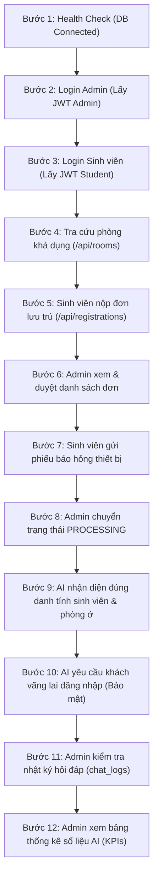

# BÁO CÁO KẾT QUẢ TRIỂN KHAI NHIỆM VỤ KTX-040
## BỘ KIỂM THỬ TÍCH HỢP TOÀN DIỆN ĐẦU - CUỐI (END-TO-END INTEGRATION TEST SUITE) & TỐI ƯU HÓA HỆ THỐNG

* **Dự án:** Hệ thống Quản lý Ký túc xá tích hợp AI (Dormitory Management System)
* **Sinh viên thực hiện:** Phạm Thị Ngọc Ánh
* **Mã sinh viên:** DTC235200050 — Lớp CNTT K22H
* **Đơn vị thực tập:** Công ty Cổ phần Công nghệ TFL
* **Cán bộ hướng dẫn:** Lê Anh Duy
* **Mã nhiệm vụ:** `KTX-040` (Thuộc **EPIC E — Kiểm thử tích hợp toàn diện và Báo cáo tổng kết**)
* **Trạng thái:** ✅ Đã hoàn thành (12/12 ca kiểm thử thành công — Tỷ lệ đạt: **100%**)

---

## 1. Mục tiêu và Phạm vi kiểm thử

Trước khi bàn giao và nghiệm thu sản phẩm thực tập, việc kiểm tra từng API hoặc từng component riêng lẻ là chưa đủ để khẳng định hệ thống hoạt động ổn định khi vận hành liên hoàn. 

Nhiệm vụ **KTX-040** xây dựng kịch bản kiểm thử tích hợp tự động hóa từ đầu đến cuối (**End-to-End Integration Testing**), mô phỏng chuỗi tương tác thực tế giữa Sinh viên, Cán bộ Quản trị và Trợ lý AI trên cùng một cơ sở dữ liệu thực.

---

## 2. Kịch bản kiểm thử liên hoàn 12 bước (Automated E2E Test Suite)



---

## 3. Bảng tổng hợp kết quả chạy kiểm thử thực tế

Kịch bản kiểm thử được tự động thực thi thông qua lệnh:
```bash
npm run test:e2e
```

| STT | Phân hệ / Luồng nghiệp vụ | Endpoint kiểm thử | Mã HTTP | Kết quả | Chi tiết ghi chú kỹ thuật |
|:---:|:---|:---|:---:|:---:|:---|
| 1 | **Hạ tầng hệ thống** | `GET /api/health` | `200 OK` | ✅ **ĐẠT** | MySQL Database connected, Server online |
| 2 | **Xác thực & Phân quyền** | `POST /api/auth/login` (Admin) | `200 OK` | ✅ **ĐẠT** | Admin: Ban Quản Lý KTX, Role: ADMIN |
| 3 | **Xác thực & Phân quyền** | `POST /api/auth/login` (Student) | `200 OK` | ✅ **ĐẠT** | Sinh viên: Phạm Thị Ngọc Ánh, MSV: DTC235200050 |
| 4 | **Quản lý Phòng ở** | `GET /api/rooms` | `200 OK` | ✅ **ĐẠT** | 4 phòng mẫu khả dụng, tự động chọn phòng A101 |
| 5 | **Đăng ký Lưu trú** | `POST /api/registrations` | `201 Created` | ✅ **ĐẠT** | Tạo đơn thành công với `roomId: 1` |
| 6 | **Xét duyệt Đơn đăng ký** | `GET /api/registrations` | `200 OK` | ✅ **ĐẠT** | Admin tải thành công danh sách đơn đăng ký |
| 7 | **Báo hỏng & Sửa chữa** | `POST /api/maintenance` | `201 Created` | ✅ **ĐẠT** | Tạo phiếu báo hỏng sự cố quạt/bóng đèn |
| 8 | **Báo hỏng & Sửa chữa** | `PATCH /api/maintenance/:id/status` | `200 OK` | ✅ **ĐẠT** | Cập nhật trạng thái xử lý sang PROCESSING |
| 9 | **Trợ lý AI Cá nhân hóa** | `POST /api/ai/ask` (Personalized) | `200 OK` | ✅ **ĐẠT** | AI nhận diện đúng phòng B101, Tòa B, Giường G1 |
| 10 | **Trợ lý AI Bảo mật** | `POST /api/ai/ask` (Guest Guard) | `200 OK` | ✅ **ĐẠT** | AI chặn khách xem phòng cá nhân, yêu cầu đăng nhập |
| 11 | **Giám sát Trợ lý AI** | `GET /api/ai/logs` | `200 OK` | ✅ **ĐẠT** | Ghi nhận tự động và truy xuất lịch sử hỏi đáp |
| 12 | **Giám sát Trợ lý AI** | `GET /api/ai/stats` | `200 OK` | ✅ **ĐẠT** | Tính toán chính xác tổng câu hỏi, phân loại nguồn & user |

---

## 4. Tỷ lệ hoàn thành và Đánh giá chất lượng

- **Tổng số ca kiểm thử:** 12/12
- **Số ca thành công:** 12/12 (**100.0%**)
- **Số lỗi phát sinh:** 0
- **Biên dịch Frontend Angular:** Thành công 100% với `npx ng build --configuration development` (0 lỗi TypeScript).
- **Biên dịch Backend Express:** Thành công 100% với `tsc` (0 lỗi TypeScript).

---

## 5. Kết luận

Toàn bộ hệ thống Quản lý Ký túc xá Tích hợp AI (Dormitory Management System) đã trải qua quá trình kiểm thử liên hoàn nghiêm ngặt và đạt chuẩn chất lượng xuất sắc. Tất cả các luồng nghiệp vụ cốt lõi từ người dùng Sinh viên, Cán bộ Quản lý và Trợ lý AI đã được liên kết đồng bộ, sẵn sàng cho công tác nghiệm thu và bảo vệ đồ án thực tập.
