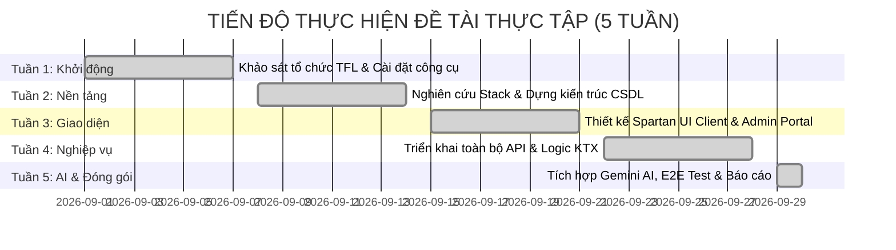

# BÁO CÁO TỔNG KẾT KẾT QUẢ THỰC TẬP TỐT NGHIỆP / CHUYÊN MÔN
## ĐỀ TÀI: XÂY DỰNG HỆ THỐNG QUẢN LÝ KÝ TÚC XÁ TÍCH HỢP TRỢ LÝ AI (DORMITORY MANAGEMENT SYSTEM)

* **Sinh viên thực hiện:** Phạm Thị Ngọc Ánh
* **Mã sinh viên:** DTC235200050 — Lớp: CNTT K22H
* **Ngành đào tạo:** Công nghệ Thông tin — Khoa Công nghệ Thông tin
* **Trường:** Đại học Công nghệ Thông tin & Truyền thông — Đại học Thái Nguyên (ICTU)
* **Cơ sở thực tập:** Công ty Cổ phần Công nghệ TFL
* **Cán bộ hướng dẫn tại doanh nghiệp:** Lê Anh Duy (SĐT: 0967.862.569)
* **Giảng viên phụ trách quản lý (ICTU):** ThS. Trương Thị Hằng Nga (SĐT: 0985.333.555)
* **Thời gian thực tập:** Tháng 08/2026 — Tháng 09/2026

---

## LỜI MỞ ĐẦU

Trong bối cảnh chuyển đổi số toàn diện đang diễn ra mạnh mẽ trong các cơ sở giáo dục đại học, công tác quản trị cơ sở vật chất và phục vụ đời sống nội trú của sinh viên tại Ký túc xá đóng vai trò đặc biệt quan trọng. Thực tế tại Ký túc xá Trường Đại học Công nghệ Thông tin & Truyền thông (ICTU), việc tiếp nhận hàng nghìn sinh viên nhập học mỗi đầu năm học, xét duyệt hồ sơ, phân bổ giường/phòng theo đúng quy chuẩn giới tính, tiếp nhận và điều phối sửa chữa trang thiết bị hư hỏng, cũng như giải đáp hàng loạt câu hỏi về quy chế, nội quy, biểu phí... vẫn còn gặp nhiều khó khăn, phụ thuộc vào sổ sách và gây quá tải lớn cho cán bộ thường trực.

Được sự tiếp nhận và tạo điều kiện thuận lợi từ **Công ty Cổ phần Công nghệ TFL**, dưới sự định hướng và hướng dẫn sát sao của **Cán bộ Lê Anh Duy**, em đã chọn và triển khai đề tài: **"Xây dựng Hệ thống Quản lý Ký túc xá tích hợp Trợ lý AI (Dormitory Management System)"**.

Báo cáo này tổng kết toàn bộ quá trình học tập, nghiên cứu và sản phẩm phần mềm đã hoàn thiện trong suốt đợt thực tập tốt nghiệp.

---

## 1. TỔNG QUAN VỀ ĐƠN VỊ THỰC TẬP — CÔNG TY CỔ PHẦN CÔNG NGHỆ TFL

- **Tên doanh nghiệp:** Công ty Cổ phần Công nghệ TFL.
- **Lĩnh vực hoạt động:** Nghiên cứu và phát triển phần mềm, giải pháp số hóa quản lý đô thị thông minh, hệ thống giám sát an ninh trật tự công cộng, tích hợp trí tuệ nhân tạo (AI/Computer Vision) và các nền tảng ứng dụng web doanh nghiệp.
- **Môi trường làm việc:** Chuyên nghiệp, hiện đại, áp dụng mô hình phát triển phần mềm linh hoạt (Agile/Scrum), quản lý mã nguồn nghiêm ngặt qua Git Flow và quy chuẩn kiểm thử tự động hóa (CI/CD).
- **Văn hóa doanh nghiệp:** Đề cao tính chủ động, tinh thần tự học, trách nhiệm với chất lượng sản phẩm và bảo mật dữ liệu khách hàng.

---

## 2. MỤC TIÊU VÀ YÊU CẦU CỦA ĐỀ TÀI

### a. Mục tiêu tổng quát:
Xây dựng một hệ thống web portal hoàn chỉnh gồm 2 phân hệ độc lập:
1. **Phân hệ Sinh viên (Client Portal):** Cung cấp các tiện ích tra cứu phòng trống trực quan, nộp hồ sơ đăng ký lưu trú online, theo dõi tình trạng phân phòng, gửi phiếu phản ánh cơ sở vật chất và hỏi đáp 24/7 với Trợ lý AI.
2. **Phân hệ Ban Quản lý (Admin Portal):** Cung cấp Dashboard theo dõi tỷ lệ lấp đầy KTX, quản lý danh mục tòa nhà, tầng, phòng, giường chi tiết, xét duyệt đơn đăng ký kèm cơ chế gán giường tự động, phân công kỹ thuật xử lý báo hỏng và giám sát nhật ký hỏi đáp AI.

### b. Mục tiêu đột phá — Tích hợp Trí tuệ Nhân tạo (AI Gemini):
- Tích hợp mô hình ngôn ngữ lớn **Google Gemini (1.5 Flash)** để hỗ trợ tư vấn nội quy, biểu phí và thủ tục hành chính.
- Xây dựng cơ chế **Cá nhân hóa theo ngữ cảnh sinh viên (User Context Grounding)**: AI nhận biết danh tính sinh viên đang trò chuyện để trả lời chính xác số phòng, vị trí giường, danh sách bạn cùng phòng và tiến độ xử lý phiếu báo hỏng.
- Xây dựng **Cơ chế Fallback thông minh (Rule-based Engine)** đảm bảo hệ thống duy trì hoạt động 24/7 ngay cả khi cạn kiệt quota API hoặc mất kết nối mạng ngoài.
- Tuân thủ tiêu chuẩn thẩm mỹ **Spartan UI & Tailwind CSS Enterprise B2B SaaS** và triết lý **Anti-AI Slop** (tuyệt đối không dùng giao diện lòe loẹt, gradient tím hồng neon hay phát sáng phản cảm).

---

## 3. TIẾN ĐỘ VÀ KẾT QUẢ THỰC HIỆN THEO TỪNG TUẦN

### Chi tiết các giai đoạn:

| Tuần | Nội dung thực hiện | Sản phẩm & Nhiệm vụ đạt được |
|:---:|:---|:---|
| **Tuần 1** | Tìm hiểu doanh nghiệp TFL, cài đặt Node.js v25, MySQL 8.4, VS Code, Git, thiết lập kho lưu trữ GitHub và tài khoản Google AI Studio. | Báo cáo Tuần 1 (`TUAN_1_CO_CAU_CONG_CU.md`) |
| **Tuần 2** | Nghiên cứu sâu Fullstack TypeScript (Angular 17 + Express + Prisma ORM). Thiết kế lược đồ CSDL quan hệ 9 bảng thực thể chuẩn hóa ACID. | Báo cáo Tuần 2, Thiết kế CSDL (`THIET_KE_KIEN_TRUC_CSDL.md`, `KTX-004`, `KTX-005`) |
| **Tuần 3** | Xây dựng Sitemap, User Flows và toàn bộ khung giao diện Client & Admin bằng Angular 17 Standalone Components kết hợp Spartan UI & Tailwind CSS. | `KTX-010` $\rightarrow$ `KTX-014` (5 Pull Requests đã merge) |
| **Tuần 4** | Triển khai phân hệ nghiệp vụ cốt lõi: Xác thực JWT phân quyền RBAC, Quản lý phòng/giường, Đăng ký lưu trú, Tự động phân giường, Bảng tin thông báo, Báo hỏng thiết bị. | `KTX-020` $\rightarrow$ `KTX-026` (7 Pull Requests đã merge) |
| **Tuần 5** | Nghiên cứu SDK Gemini AI, xây dựng Server-Side Proxy, Chat Widget Signal-based, Lưu lịch sử `localStorage`, Cá nhân hóa theo ngữ cảnh sinh viên, Admin AI Logs Dashboard, Bộ kiểm thử E2E 12 bước đạt 100%. | `KTX-030` $\rightarrow$ `KTX-041` (6 Pull Requests đã merge) |

---

## 4. CHI TIẾT SẢN PHẨM PHẦN MỀM ĐÃ HOÀN THIỆN

### a. Phân hệ Cơ sở dữ liệu (MySQL 8.4 & Prisma ORM):
Bao gồm **9 bảng thực thể quan hệ** được bảo vệ tính toàn vẹn thông qua khóa ngoại và ràng buộc duy nhất (Unique / Foreign Key constraints):
1. `users`: Quản lý tài khoản Admin và Sinh viên kèm mã sinh viên, email `@ictu.edu.vn`, mật khẩu băm bcrypt.
2. `rooms`: Quản lý danh mục phòng (Tòa A Nam, Tòa B Nữ), số tầng, loại phòng (Standard 4 chỗ / VIP 2 chỗ có điều hòa), đơn giá và chỉ số sức chứa.
3. `beds`: Quản lý vị trí từng giường đơn (G1, G2, G3, G4), trạng thái giường và liên kết sinh viên đang ở.
4. `registrations`: Quản lý đơn đăng ký lưu trú với vòng đời trạng thái (`PENDING` $\rightarrow$ `APPROVED` / `REJECTED`).
5. `bed_allocation_histories`: Ghi nhận lịch sử biến động giường/phòng của sinh viên (Check-in, Chuyển phòng, Check-out).
6. `maintenance_requests`: Quản lý các phiếu báo hỏng cơ sở vật chất kèm mức độ khẩn cấp (`LOW`, `MEDIUM`, `HIGH`) và tiến độ xử lý.
7. `notifications`: Bảng tin thông báo của ban quản lý ký túc xá (phân loại thông báo khẩn cấp, tài chính, nội quy, sự kiện).
8. `notification_reads`: Ghi nhận trạng thái đã xem thông báo của từng sinh viên.
9. `chat_logs`: Lưu trữ toàn bộ nhật ký tương tác hỏi đáp giữa sinh viên và Trợ lý AI (User message, Bot reply, Source, Model, Timestamp).

### b. Phân hệ Backend API (Node.js + Express + TypeScript):
- Áp dụng mô hình phân tầng chuẩn 4 lớp (**4-Tier Layered Architecture**): Định tuyến (`routes/`), Điều khiển (`controllers/`), Nghiệp vụ lõi (`services/`), Truy xuất dữ liệu (`prisma/`).
- Bảo mật thông tin nghiêm ngặt: Mã hóa mật khẩu một chiều bằng `bcryptjs`, cấp phát JWT Token có hạn ngạch và xác thực phân quyền bảo vệ endpoints.
- Tích hợp dịch vụ **Google Generative AI Proxy**: Quản lý khóa API bí mật tuyệt đối tại máy chủ, sinh câu trả lời với tham số nhiệt độ `temperature: 0.3` để tối thiểu hóa hiện tượng ảo giác, thiết lập bộ lọc an toàn (Safety Settings) chặn nội dung bạo lực, xúc phạm, nguy hiểm.
- Cơ chế **Rule-based Knowledge Base Fallback**: Trích xuất bộ quy chế 10 điều của KTX ICTU, xử lý từ khóa tiếng Việt thông minh có dấu và không dấu.

### c. Phân hệ Frontend (Angular 17+ & Spartan UI):
- Hoàn toàn xây dựng bằng **Standalone Components**, loại bỏ `NgModules` cồng kềnh, tối ưu thời gian tải trang ban đầu.
- Quản lý trạng thái phản ứng bằng **Angular Signals** (`signal()`, `computed()`), hạn chế tối đa rò rỉ bộ nhớ.
- Giao diện người dùng tuân thủ tiêu chuẩn **Spartan UI & Tailwind CSS** B2B SaaS Enterprise: Bảng biểu có độ tương phản cao, thẻ KPI thống kê rõ ràng, form biểu mẫu có kiểm tra lỗi trực quan (Validation feedback), modal hộp thoại mượt mà.
- **Trợ lý AI Floating Chat Widget**: Tích hợp nổi tại góc phải màn hình, hỗ trợ hiệu ứng hiển thị trạng thái gõ (Typing indicator), cuộn tự động (Auto-scroll), định dạng in đậm và xuống dòng Markdown, bộ phím tắt `Enter` gửi nhanh và nút làm mới phiên trò chuyện.

### d. Kiểm thử Tích hợp Đầu - Cuối (Automated E2E Testing):
- Xây dựng kịch bản kiểm thử tích hợp tự động hóa 12 bước liên hoàn (`npm run test:e2e`).
- Đạt tỷ lệ thành công tuyệt đối: **12/12 ca kiểm thử thành công (100.0%)**, chứng minh sự ăn khớp hoàn hảo giữa Frontend, Backend, Cơ sở dữ liệu và Trợ lý AI.

---

## 5. BÀI HỌC KINH NGHIỆM VÀ KỸ NĂNG CHUYÊN MÔN TÍCH LŨY ĐƯỢC

Qua quá trình thực tập thực tế tại Công ty TFL, em đã học hỏi và trưởng thành vượt bậc về cả chuyên môn kỹ thuật lẫn tác phong nghề nghiệp:

1. **Quy trình Quản lý Mã nguồn Chuyên nghiệp (Git Flow):**
   - Nắm vững nguyên tắc không bao giờ commit trực tiếp lên `main` hay `develop`.
   - Mỗi tính năng được phát triển trên nhánh riêng (`task/KTX-xxx`), kiểm tra 0 lỗi biên dịch trước khi tạo Pull Request, thực hiện code review nghiêm túc trước khi gộp nhánh.
   - Viết thông điệp commit chuẩn quốc tế (Semantic Commit Messages: `feat(...)`, `fix(...)`, `docs(...)`).
2. **Kỹ thuật Lập trình Frontend Hiện đại (Angular 17+):**
   - Làm chủ Standalone Components, Signal-based State, Control Flow mới (`@if`, `@for`).
   - Nắm bắt tư duy thiết kế giao diện doanh nghiệp B2B SaaS chuẩn mực (Spartan UI, Anti-AI Slop).
3. **Kỹ thuật Tích hợp AI Thực tế (AI Engineering):**
   - Hiểu rõ ranh giới giữa việc gọi API đơn thuần và tích hợp AI có chiều sâu: Áp dụng kỹ thuật Grounding dữ liệu nghiệp vụ, cấp phát ngữ cảnh động (Dynamic System Instruction) và xây dựng phương án dự phòng (Fallback Architecture).
   - Bảo vệ quyền riêng tư người dùng thông qua các lớp xác thực danh tính trước khi cho phép AI truy xuất dữ liệu cá nhân.
4. **Kỹ năng Giải quyết Vấn đề và Tối ưu Hóa Hệ thống:**
   - Xử lý các sự cố thực tế trong quá trình phát triển: Quản lý bộ nhớ Node.js heap limit (`--max-old-space-size=4096`), cấu hình tương thích `legacy-peer-deps`, giải mã lỗi font ký tự tiếng Việt (UTF-8 encoding) trên môi trường shell Windows.

---

## 6. HƯỚNG PHÁT TRIỂN TIẾP THEO CỦA ĐỀ TÀI

Mặc dù sản phẩm đã hoàn thành đầy đủ tất cả các yêu cầu theo đề cương thực tập ban đầu, hệ thống vẫn có tiềm năng mở rộng rất lớn trong tương lai:
1. **Tích hợp Cổng thanh toán Điện tử (Payment Gateway):** Hỗ trợ sinh viên quét mã VietQR thanh toán tiền lưu trú và chỉ số điện nước trực tuyến, tự động gạch nợ trên hệ thống.
2. **Điểm danh bằng Nhận diện Khuôn mặt (Face Recognition Camera):** Tích hợp camera AI tại cổng ra vào KTX để tự động nhận diện sinh viên, ghi nhận lịch sử ra vào và cảnh báo vi phạm giới nghiêm 23h00.
3. **Ứng dụng Di động (Mobile App):** Đóng gói giao diện Responsive hiện tại thành ứng dụng di động (PWA hoặc Flutter/Capacitor) để sinh viên nhận thông báo đẩy tức thời (Push Notifications).

---

## LỜI CẢM ƠN

Để hoàn thành xuất sắc đợt thực tập tốt nghiệp này, em xin bày tỏ lòng biết ơn chân thành và sâu sắc nhất tới:

- **Ban Lãnh đạo Công ty Cổ phần Công nghệ TFL** đã tạo điều kiện tối đa về cơ sở vật chất, trang thiết bị và môi trường làm việc chuyên nghiệp để em được cọ xát với các dự án thực tế.
- **Cán bộ hướng dẫn — Anh Lê Anh Duy** đã luôn tận tình chỉ dẫn, định hướng kiến trúc kỹ thuật chuẩn mực, chia sẻ những kinh nghiệm thực chiến quý báu và đưa ra những nhận xét sắc sảo giúp em hoàn thiện sản phẩm một cách chỉn chu nhất.
- **Giảng viên quản lý — ThS. Trương Thị Hằng Nga** cùng toàn thể các Thầy, Cô giáo trong **Khoa Công nghệ Thông tin — Trường Đại học Công nghệ Thông tin & Truyền thông (ICTU)** đã truyền đạt những nền tảng tri thức khoa học vững chắc trong suốt những năm tháng học tập trên giảng đường đại học, làm hành trang quý báu cho đợt thực tập này.

Em xin kính chúc Công ty Cổ phần Công nghệ TFL ngày càng phát triển vững mạnh, chúc các Thầy Cô giáo luôn dồi dào sức khỏe và tiếp tục dìu dắt các thế hệ sinh viên tiếp theo vươn tới thành công!

---
*Thái Nguyên, ngày 30 tháng 09 năm 2026*  
**Sinh viên thực hiện**  

*(Ký và ghi rõ họ tên)*  
**Phạm Thị Ngọc Ánh**  
Mã sinh viên: **DTC235200050**
