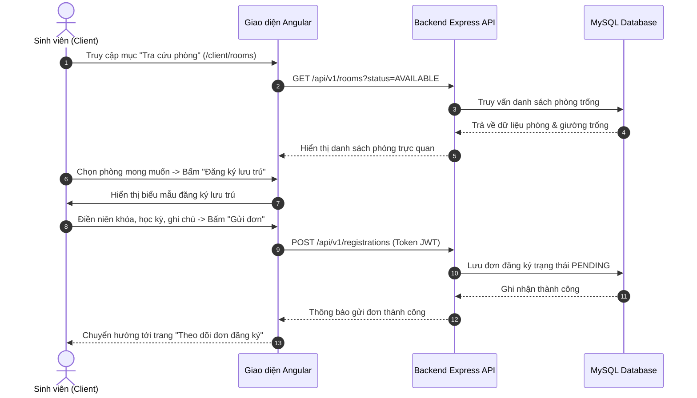
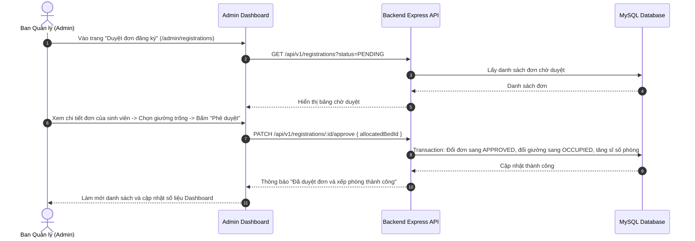
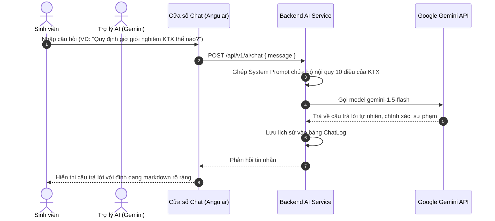

# KẾ HOẠCH VÀ LUỒNG MÀN HÌNH HỆ THỐNG (KTX-010)
## SITEMAP VÀ USER FLOWS CHO PHÂN HỆ CLIENT & ADMIN

* **Dự án:** Hệ thống Quản lý Ký túc xá tích hợp AI (Dormitory Management System)
* **Sinh viên thực hiện:** Phạm Thị Ngọc Ánh - MSV: DTC235200050 (CNTT K22H)
* **Đơn vị thực tập:** Công ty Cổ phần Công nghệ TFL
* **Cán bộ hướng dẫn:** Lê Anh Duy

---

## 1. Tổng quan cấu trúc giao diện hệ thống

Ứng dụng web được phân chia thành 2 phân hệ độc lập về mặt trải nghiệm người dùng và điều hướng:
1. **Phân hệ Client (Cổng thông tin Sinh viên):** Tối ưu hóa tính tiện ích, thân thiện trên cả máy tính và thiết bị di động, tập trung vào việc tra cứu phòng, nộp đơn đăng ký lưu trú, gửi phiếu báo hỏng và chat trực tiếp với Trợ lý AI (Gemini).
2. **Phân hệ Admin (Bảng điều khiển Ban Quản lý):** Thiết kế dạng Dashboard quản trị chuyên nghiệp, hiển thị thống kê tổng quan (KPIs), quản lý danh mục phòng/giường dạng bảng lưới trực quan, xử lý duyệt đơn đăng ký và điều phối sửa chữa cơ sở vật chất.

---

## 2. Sơ đồ cấu trúc các trang (Sitemap)

```mermaid
flowchart TD
    Root["Trang chủ Hệ thống KTX (/)"] --> Auth["Xác thực Người dùng"]
    Auth --> Login["Đăng nhập (/auth/login)"]
    Auth --> Register["Đăng ký tài khoản Sinh viên (/auth/register)"]

    Root --> ClientPortal["CỔNG THÔNG TIN SINH VIÊN (/client)"]
    ClientPortal --> CDashboard["Tổng quan cá nhân (/client/dashboard)<br>- Thông tin phòng đang ở<br>- Số giường & bạn cùng phòng<br>- Lịch sử lưu trú"]
    ClientPortal --> CRooms["Tra cứu phòng trống (/client/rooms)<br>- Bộ lọc Tòa nhà, Tầng, Loại phòng<br>- Chi tiết tiện ích & đơn giá"]
    ClientPortal --> CRegister["Đăng ký lưu trú (/client/register-room)<br>- Điền form đăng ký<br>- Chọn phòng nguyện vọng<br>- Theo dõi trạng thái đơn"]
    ClientPortal --> CMaintenance["Báo hỏng cơ sở vật chất (/client/maintenance)<br>- Tạo phiếu yêu cầu sửa chữa<br>- Theo dõi tiến độ xử lý"]
    ClientPortal --> CNotifications["Bảng tin thông báo (/client/notifications)"]
    ClientPortal --> CAIChat["Trợ lý ảo AI Gemini (Widget nổi góc phải màn hình)"]

    Root --> AdminPortal["BẢNG ĐIỀU KHIỂN QUẢN TRỊ (/admin)"]
    AdminPortal --> ADashboard["Dashboard Tổng quan (/admin/dashboard)<br>- Thống kê tổng số phòng, giường trống<br>- Tỷ lệ lấp đầy KTX<br>- Số đơn chờ duyệt & sự cố cần xử lý"]
    AdminPortal --> ARooms["Quản lý Phòng & Giường (/admin/rooms)<br>- Danh sách phòng theo Tòa/Tầng<br>- Thêm, sửa, đổi trạng thái phòng<br>- Quản lý chi tiết từng giường"]
    AdminPortal --> AStudents["Quản lý Sinh viên (/admin/students)<br>- Danh bạ sinh viên nội trú<br>- Hồ sơ cá nhân, lịch sử ở"]
    AdminPortal --> ARegistrations["Quản lý Đơn đăng ký (/admin/registrations)<br>- Danh sách đơn PENDING<br>- Xét duyệt / Từ chối đơn<br>- Tự động phân phòng & gán giường"]
    AdminPortal --> AMaintenance["Quản lý Sửa chữa (/admin/maintenance)<br>- Tiếp nhận báo hỏng thiết bị<br>- Phân công kỹ thuật & cập nhật tiến độ"]
    AdminPortal --> ANotifications["Quản lý Thông báo (/admin/notifications)<br>- Đăng tin mới, ghim bảng tin"]
    AdminPortal --> AAIMonitor["Giám sát Trợ lý AI (/admin/ai-logs)<br>- Lịch sử hỏi đáp của sinh viên<br>- Đánh giá chất lượng câu trả lời"]
```

---

## 3. Sơ đồ luồng người dùng (User Flows)

### a. Luồng Sinh viên: Tra cứu và Đăng ký phòng lưu trú

### b. Luồng Ban Quản lý: Xét duyệt đơn và Tự động gán giường

### c. Luồng Tương tác Trợ lý ảo AI Gemini

---

## 4. Đặc tả trạng thái phản hồi giao diện (UI State Guidelines)

Tuân thủ nghiêm ngặt tiêu chí chấp nhận của EPIC B (KTX-013, KTX-014), mọi màn hình đều phải xử lý đủ 4 trạng thái:
1. **Loading State (Đang tải):** Hiển thị Spinner hoặc Skeleton Loading, không để màn hình bị đơ hoặc trắng trang.
2. **Empty State (Dữ liệu rỗng):** Khi không có dữ liệu (ví dụ: chưa có thông báo nào, không có đơn chờ duyệt), hiển thị hình minh họa và thông điệp hướng dẫn thân thiện.
3. **Error State (Lỗi kết nối / Máy chủ):** Khi mất mạng hoặc API trả về lỗi 500, hiển thị Toast cảnh báo rõ ràng kèm nút "Thử lại".
4. **Success State (Thành công):** Thông báo phản hồi tích cực bằng Snackbar/Toast khi thêm/sửa/xóa thành công.

---

## 5. Kết luận nghiệm thu KTX-010
Bản thiết kế Sitemap và User Flows đã được hoàn thiện đầy đủ, thống nhất với cán bộ hướng dẫn tại doanh nghiệp (Lê Anh Duy). Đây là cơ sở kiến trúc trực quan để bắt tay vào xây dựng bộ khung giao diện Client (**KTX-011**) và Admin (**KTX-012**).
