# KHẢO SÁT YÊU CẦU HỆ THỐNG QUẢN LÝ KÝ TÚC XÁ TÍCH HỢP AI (KTX-002)

* **Dự án:** Hệ thống Quản lý Ký túc xá tích hợp AI (Dormitory Management System)
* **Sinh viên thực hiện:** Phạm Thị Ngọc Ánh - MSV: DTC235200050 (Lớp CNTT K22H)
* **Đơn vị thực tập:** Công ty Cổ phần Công nghệ TFL
* **Cán bộ hướng dẫn:** Lê Anh Duy

---

## 1. Mục tiêu hệ thống
- Tin học hóa toàn diện quy trình tiếp nhận sinh viên, đăng ký lưu trú, xét duyệt và tự động xếp phòng/giường.
- Cung cấp giao diện trực quan cho Ban Quản lý KTX (Admin) để giám sát tình trạng phòng, số giường trống, theo dõi danh sách sinh viên nội trú.
- Cung cấp cổng thông tin tiện ích cho Sinh viên (Client): nộp hồ sơ trực tuyến, tra cứu thông tin phòng/bạn cùng phòng, gửi phiếu yêu cầu sửa chữa cơ sở vật chất.
- Tích hợp trợ lý ảo AI (Google Gemini) để hỗ trợ giải đáp 24/7 các thắc mắc về nội quy, biểu phí, thủ tục hành chính, giải tỏa khối lượng công việc trực bàn của ban quản trị.

---

## 2. Danh sách đối tượng sử dụng và Phân quyền (Roles & CRUD Matrix)

### a. Danh sách vai trò:
1. **Admin (Ban Quản lý KTX):** Cán bộ phụ trách quản lý tòa nhà, tiếp nhận đơn đăng ký, phân phòng và xử lý các sự cố cơ sở vật chất.
2. **Client (Sinh viên lưu trú):** Sinh viên trường ICTU có nhu cầu hoặc đang ở nội trú tại ký túc xá.

### b. Ma trận phân quyền CRUD (Create - Read - Update - Delete):

| Phân hệ / Thực thể | Admin (Ban quản lý) | Client (Sinh viên) | Ghi chú bảo mật |
| :--- | :---: | :---: | :--- |
| **Tài khoản người dùng (User)** | C / R / U / D | R / U (Chỉ xem và sửa hồ sơ cá nhân của mình) | Sinh viên không được sửa vai trò `role` |
| **Danh mục Phòng & Giường (Room/Bed)** | C / R / U / D | R (Chỉ xem danh sách phòng còn trống hoặc phòng đang ở) | Sinh viên chỉ xem thông tin công khai |
| **Đơn đăng ký lưu trú (Registration)** | R / U (Duyệt/Từ chối) | C / R / U (Tạo đơn, xem đơn của mình, hủy khi PENDING) | Không được tự đổi trạng thái sang APPROVED |
| **Phiếu báo hỏng (MaintenanceRequest)**| R / U (Cập nhật tiến độ) | C / R (Tạo phiếu, theo dõi trạng thái phiếu của mình) | Trạng thái do Admin quản lý |
| **Thông báo chung (Notification)** | C / R / U / D | R (Xem danh sách thông báo) | Sinh viên chỉ đọc |
| **Trợ lý ảo AI (Chatbot Gemini)** | R (Xem log đánh giá chất lượng) | C / R (Gửi câu hỏi và nhận câu trả lời) | Rate limiting chống spam prompt |

---

## 3. Các luồng nghiệp vụ cốt lõi (User Flows)

```mermaid
flowchart TD
    subgraph Flow1["Luồng 1: Đăng ký & Xét duyệt phòng"]
        A1["Sinh viên xem phòng trống"] --> A2["Điền form đăng ký lưu trú"]
        A2 --> A3["Đơn ở trạng thái PENDING"]
        A3 --> A4{"Admin xét duyệt?"}
        A4 -- Duyệt --> A5["Chuyển trạng thái APPROVED<br>Tự động gán giường, trừ sức chứa"]
        A4 -- Từ chối --> A6["Chuyển trạng thái REJECTED<br>Ghi rõ lý do gửi sinh viên"]
    end

    subgraph Flow2["Luồng 2: Báo hỏng thiết bị"]
        B1["Sinh viên phát hiện thiết bị hỏng"] --> B2["Tạo phiếu báo hỏng<br>(Chọn phòng, thiết bị, mức độ gấp)"]
        B2 --> B3["Admin tiếp nhận -> Đổi sang PROCESSING"]
        B3 --> B4["Kỹ thuật sửa chữa hoàn tất"]
        B4 --> B5["Admin chuyển trạng thái RESOLVED"]
    end

    subgraph Flow3["Luồng 3: Trợ lý ảo AI tư vấn"]
        C1["Sinh viên đặt câu hỏi nội quy KTX"] --> C2["Backend kiểm tra & gắn System Prompt quy chế KTX"]
        C2 --> C3["Gọi Google Gemini 1.5 Flash API"]
        C3 --> C4["Trả về câu trả lời chuẩn xác & lịch sự"]
    end
```

---

## 4. Kịch bản khảo sát tích hợp Trợ lý AI (Gemini Use Cases)

Qua khảo sát thực tế tại KTX, trợ lý ảo Gemini sẽ tập trung giải quyết các nhóm câu hỏi phổ biến:
1. **Nội quy giờ giấc:** Giờ đóng/mở cửa KTX (23h00 hàng ngày), quy định tiếp khách ngoài ký túc xá.
2. **Quy định cơ sở vật chất:** Các thiết bị được phép và cấm sử dụng (cấm bếp gas, thiết bị tiêu thụ công suất lớn không đăng ký).
3. **Thủ tục hành chính:** Hồ sơ đăng ký tạm trú, thủ tục xin ra ngoài qua đêm, gia hạn hợp đồng cuối kỳ.
4. **Biểu phí và phương thức thanh toán:** Đơn giá phòng theo tháng, định mức điện nước miễn phí và giá phụ thu khi vượt định mức.

---

## 5. Phạm vi dự án (Project Scope)

* **Trong phạm vi (In-Scope - P0 & P1):**
  - Hệ thống xác thực bảo mật JWT, phân quyền Admin & Student.
  - Quản lý danh mục tòa nhà, tầng, phòng, giường chi tiết.
  - Luồng nộp đơn và duyệt đơn đăng ký lưu trú online.
  - Luồng gửi phiếu phản ánh và cập nhật tiến độ sửa chữa thiết bị.
  - Trợ lý ảo AI tư vấn quy chế nội quy tích hợp giao diện chat widget.
  - Dashboard thống kê tổng quan (tổng số phòng, tỷ lệ lấp đầy, số đơn chờ duyệt).
* **Ngoài phạm vi (Out-of-Scope - Dự kiến giai đoạn sau):**
  - Thanh toán điện tử trực tuyến (Payment Gateway).
  - Tích hợp camera AI nhận diện khuôn mặt điểm danh sinh viên.

---

## 6. Câu hỏi mở đã làm việc và thống nhất với Cán bộ hướng dẫn (Lê Anh Duy)
1. *Quy tắc xếp phòng nam/nữ:* Đã thống nhất bố trí theo từng Tòa nhà riêng biệt (Tòa A dành cho Sinh viên Nam, Tòa B dành cho Sinh viên Nữ) để đảm bảo văn minh và dễ quản lý.
2. *Cấp tài khoản:* Cho phép sinh viên tự đăng ký bằng Email trường (`@ictu.edu.vn`), tài khoản Admin được tạo sẵn qua script Seed ban đầu.
3. *Định dạng Gemini Prompt:* Dùng System Instructions chứa tóm tắt quy chế 10 điều nội quy ký túc xá của nhà trường, câu trả lời giới hạn súc tích, văn phong sư phạm và thân thiện.
