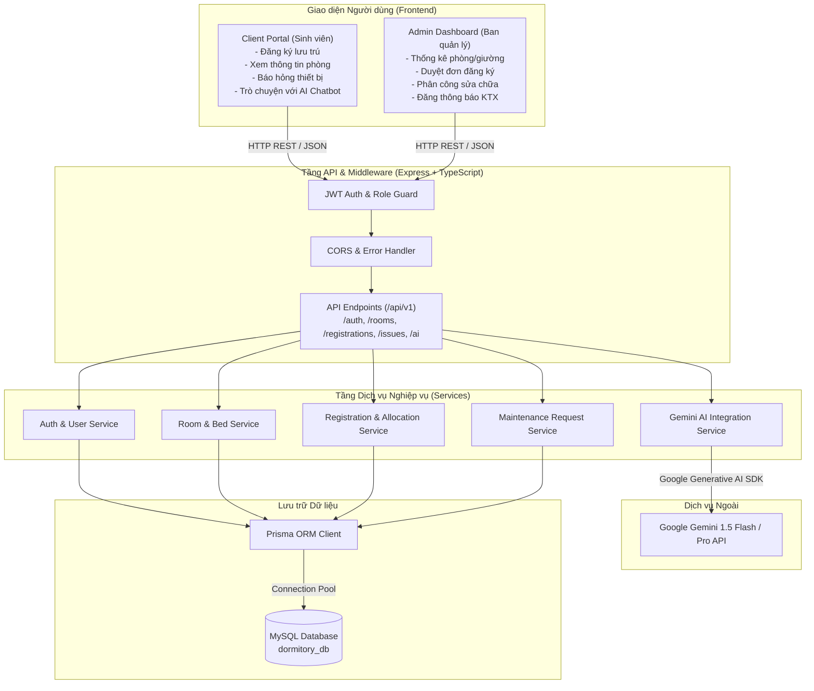
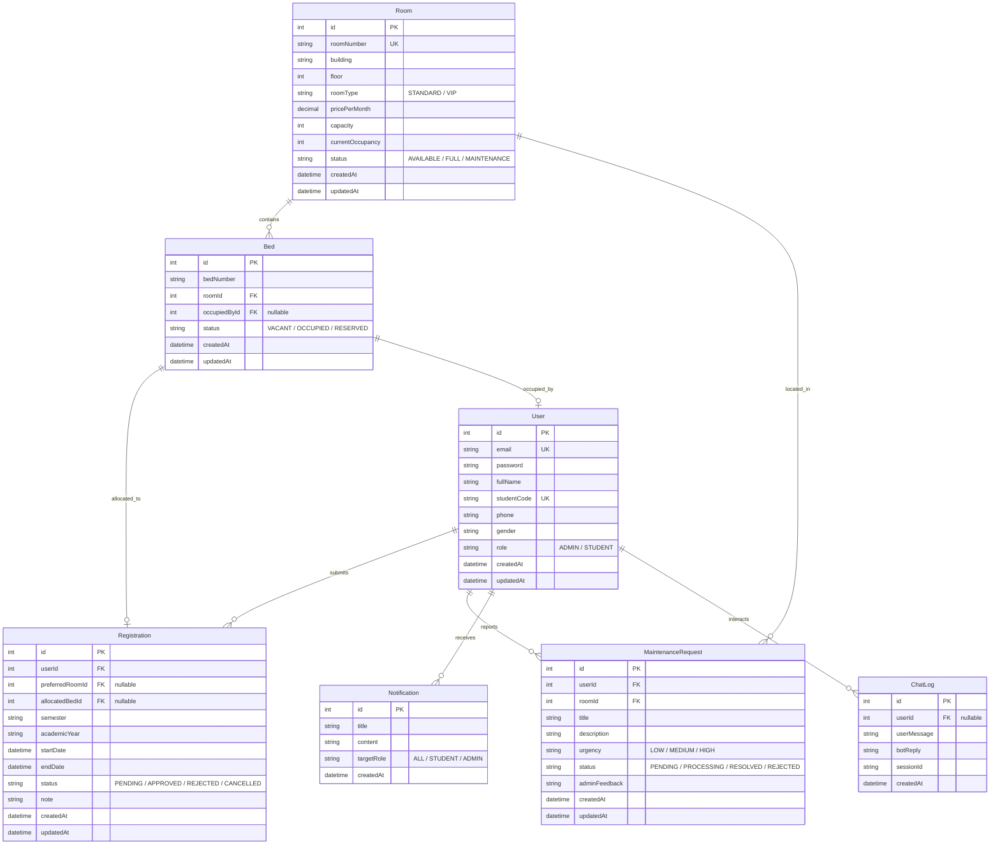

# THIẾT KẾ SƠ BỘ KIẾN TRÚC VÀ CƠ SỞ DỮ LIỆU (KTX-005)

* **Dự án:** Hệ thống Quản lý Ký túc xá tích hợp AI (Dormitory Management System)
* **Người thực hiện:** Phạm Thị Ngọc Ánh

---

## 1. Sơ đồ kiến trúc thành phần (Component Architecture)

---

## 2. Mô hình thực thể quan hệ (ERD - Entity Relationship Diagram)

---

## 3. Đặc tả chi tiết các bảng dữ liệu chính

1. **`User`**: Lưu thông tin tài khoản người dùng, phân quyền qua trường `role` (`ADMIN` hoặc `STUDENT`). Đối với sinh viên, có lưu mã sinh viên (`studentCode`), số điện thoại, giới tính để phục vụ phân phòng theo giới tính.
2. **`Room`**: Quản lý thông tin từng phòng: số phòng, tòa nhà, tầng, loại phòng, đơn giá, sức chứa tối đa và số người đang ở thực tế.
3. **`Bed`**: Quản lý chi tiết từng giường trong phòng để ngăn ngừa hiện tượng xếp trùng giường (`status`: VACANT, OCCUPIED, RESERVED).
4. **`Registration`**: Quản lý phiếu xin lưu trú KTX của sinh viên kèm trạng thái xét duyệt của Ban quản lý.
5. **`MaintenanceRequest`**: Quản lý các yêu cầu sửa chữa cơ sở vật chất phát sinh từ sinh viên.
6. **`Notification`**: Bảng tin thông báo chung của KTX.
7. **`ChatLog`**: Lưu vết các phiên hội thoại với AI để đánh giá chất lượng câu trả lời của trợ lý ảo Gemini.
