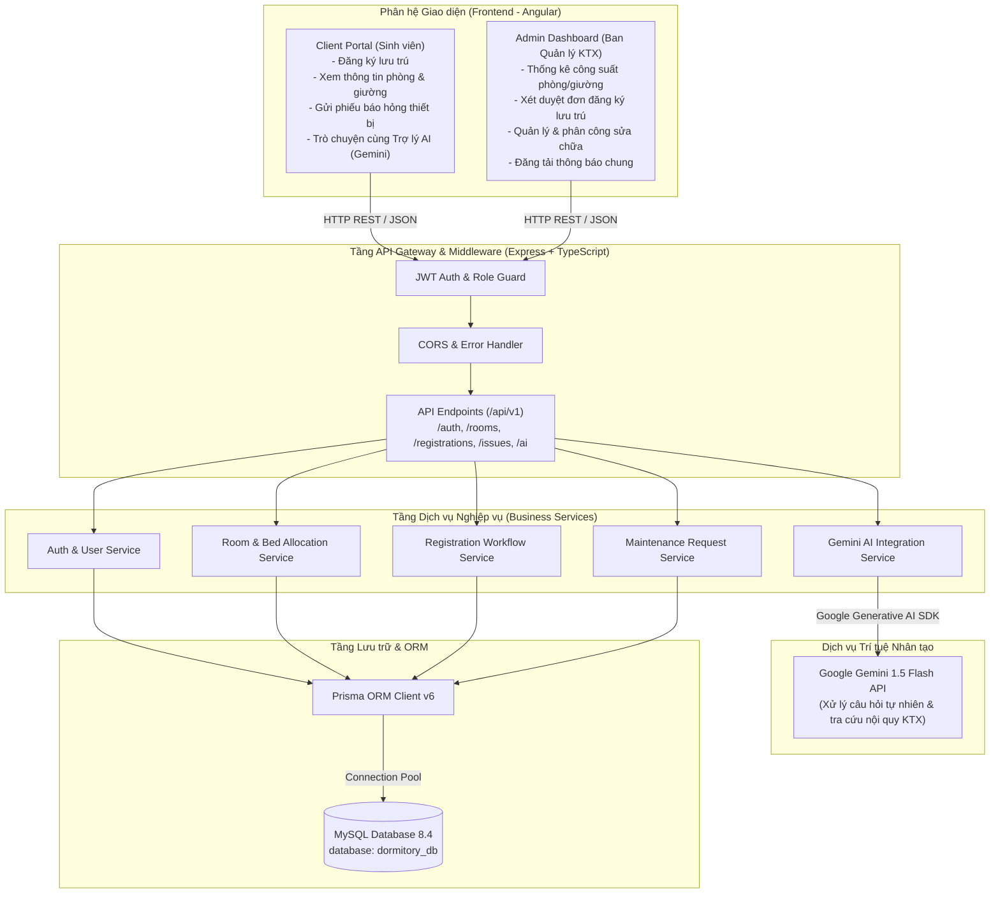
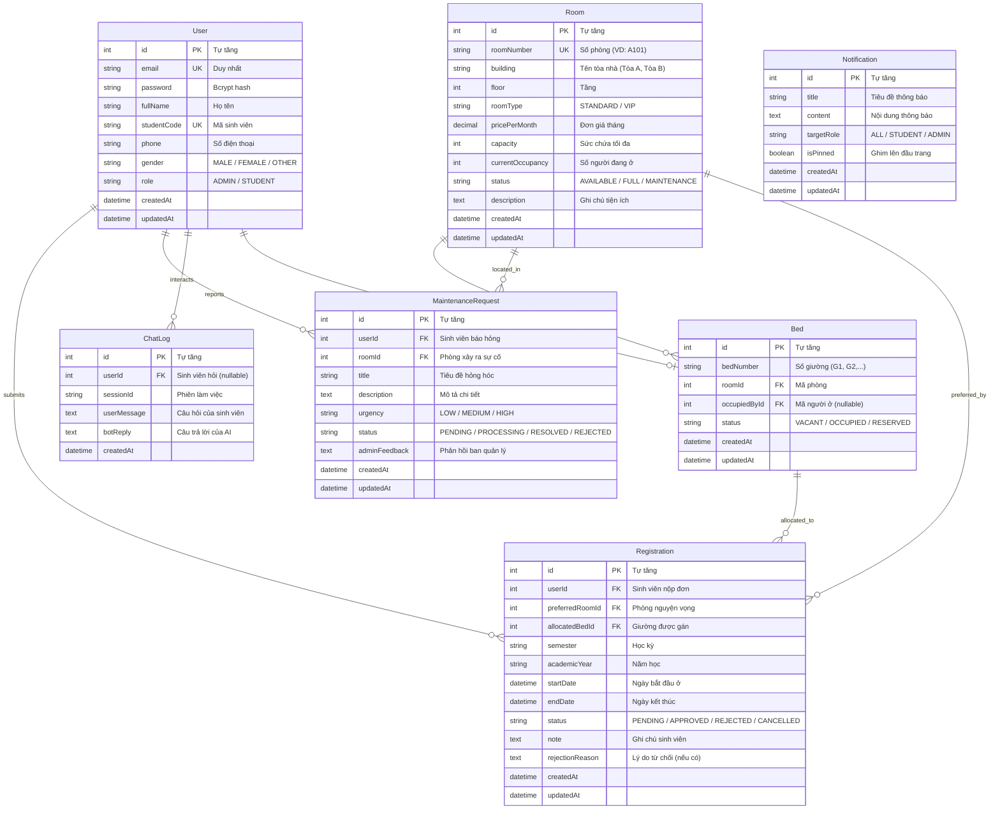

# THIẾT KẾ SƠ BỘ KIẾN TRÚC VÀ CƠ SỞ DỮ LIỆU (KTX-005)

* **Dự án:** Hệ thống Quản lý Ký túc xá tích hợp AI (Dormitory Management System)
* **Sinh viên thực hiện:** Phạm Thị Ngọc Ánh - MSV: DTC235200050 (Lớp CNTT K22H)
* **Đơn vị thực tập:** Công ty Cổ phần Công nghệ TFL
* **Cán bộ hướng dẫn:** Lê Anh Duy

---

## 1. Sơ đồ kiến trúc thành phần (Component Architecture)

---

## 2. Sơ đồ quan hệ thực thể CSDL (ERD - Entity Relationship Diagram)

---

## 3. Rà soát tính toàn vẹn và Ràng buộc dữ liệu (Integrity & Constraints)

1. **Ràng buộc duy nhất (Unique Constraints):**
   - `User.email`: Mỗi tài khoản một email duy nhất.
   - `User.studentCode`: Mã sinh viên duy nhất trong hệ thống.
   - `Room.roomNumber`: Số hiệu phòng duy nhất.
   - `[Bed.roomId, Bed.bedNumber]`: Khóa tổ hợp đảm bảo trong cùng một phòng không thể có 2 giường trùng số hiệu.
2. **Quy tắc xóa dữ liệu (Referential Actions):**
   - Khi xóa `Room`: Tự động xóa danh sách `Bed` thuộc phòng (`onDelete: Cascade`).
   - Khi xóa `User`: Xóa phiếu `Registration` và `MaintenanceRequest` tương ứng (`onDelete: Cascade`), nếu sinh viên đang ở giường thì chuyển `occupiedById` về `NULL` (`onDelete: SetNull`).
3. **Chiến lược phân phòng an toàn (Data Race Prevention):**
   - Sử dụng Transaction trong Prisma khi Admin duyệt đơn: kiểm tra trạng thái giường là `VACANT`, đổi giường sang `OCCUPIED`, gán `occupiedById` cho sinh viên và tăng `currentOccupancy` của phòng lên 1.

---

## 4. Biên bản rà soát thiết kế kiến trúc và CSDL (Architecture Sign-off)

- **Người thiết kế:** Phạm Thị Ngọc Ánh
- **Người rà soát:** Lê Anh Duy (Cán bộ hướng dẫn TFL)
- **Kết luận:** Mô hình kiến trúc 4 tầng và thiết kế CSDL 7 thực thể đã đáp ứng đầy đủ yêu cầu nghiệp vụ quản lý ký túc xá, đảm bảo chuẩn hóa dữ liệu (3NF) và có kịch bản nạp dữ liệu mẫu (`seed.ts`) hoàn chỉnh. Phê duyệt chuyển sang giai đoạn xây dựng giao diện và chức năng.
