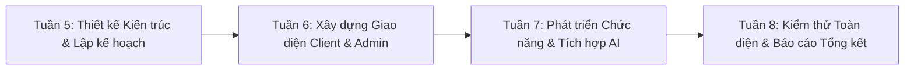

# BÁO CÁO THỰC TẬP - TUẦN 5
## LÊN KẾ HOẠCH XÂY DỰNG HỆ THỐNG QUẢN LÝ KÝ TÚC XÁ

---

* **Sinh viên thực hiện:** Phạm Thị Ngọc Ánh
* **Mã sinh viên:** DTC235200050 — Lớp: CNTT K22H
* **Trường:** Đại học Công nghệ Thông tin & Truyền thông (ICTU)
* **Cơ sở thực tập:** Công ty Cổ phần Công nghệ TFL
* **Cán bộ hướng dẫn:** Lê Anh Duy (TFL Technology JSC)
* **Giảng viên quản lý:** ThS. Trương Thị Hằng Nga (Khoa CNTT - ICTU)
* **Thời gian thực hiện:** Tuần 5 (Theo Kế hoạch Đề cương Thực tập tốt nghiệp)

---

### 1. Mục tiêu và Nhiệm vụ Tuần 5
Sau khi hoàn thành nghiên cứu công nghệ nền tảng và tìm hiểu quy trình nghiệm thu thực tế ở tháng thứ nhất, Tuần 5 đánh dấu giai đoạn chính thức bước vào triển khai sản phẩm **Hệ thống Quản lý Ký túc xá tích hợp AI (Dormitory Management System)**:
- Khảo sát các quy trình nghiệp vụ thực tế tại Ký túc xá trường Đại học CNTT & TT (ICTU).
- Xác định các tác nhân (Actors) và xây dựng bản đồ luồng tương tác người dùng (User Flows & Sitemap).
- Thiết kế mô hình cơ sở dữ liệu quan hệ 9 bảng thực thể (Database Schema) đảm bảo chuẩn hóa dữ liệu 3NF và tính toàn vẹn quan hệ (ACID).
- Lập kế hoạch phân bổ Sprint và xác lập danh mục công việc Backlog chi tiết theo các mức ưu tiên (P0, P1, TBC).

---

### 2. Xác định Các Tác nhân & Luồng Nghiệp vụ Cốt lõi
Hệ thống KTX phục vụ 2 nhóm tác nhân chính:
1. **Sinh viên lưu trú (Client / Resident):**
   - Tra cứu danh mục phòng, giường trống theo Tòa nhà và Mức giá.
   - Nộp hồ sơ đăng ký lưu trú trực tuyến kèm nguyện vọng phòng ở.
   - Theo dõi hợp đồng, thông tin phòng đang ở và bạn cùng phòng.
   - Gửi yêu cầu phản ánh, báo hỏng cơ sở vật chất kèm mức độ khẩn cấp.
   - Tương tác với Trợ lý AI để giải đáp thắc mắc nội quy và tra cứu thông tin cá nhân.
2. **Cán bộ Quản trị KTX (Admin / Manager):**
   - Quản trị cấu hình danh mục Tòa, Tầng, Phòng và Giường lưu trú.
   - Tiếp nhận, xét duyệt hoặc từ chối hồ sơ đăng ký lưu trú của sinh viên.
   - Thực hiện phân bổ giường tự động hoặc thủ công; điều chuyển phòng ở khi sinh viên có nhu cầu.
   - Tiếp nhận sự cố hỏng hóc, phân công kỹ thuật và cập nhật tiến độ xử lý.
   - Đăng tải thông báo quan trọng lên bảng tin KTX.
   - Giám sát nhật ký hỏi đáp AI và phân tích các vấn đề sinh viên thường xuyên thắc mắc.

---

### 3. Thiết kế Kiến trúc Cơ sở Dữ liệu (Prisma Schema 9 Bảng)
Cơ sở dữ liệu MySQL `dormitory_db` được thiết kế chặt chẽ qua 9 bảng thực thể:
1. `users`: Tài khoản sinh viên và cán bộ quản trị (RBAC: `STUDENT`, `ADMIN`).
2. `rooms`: Danh mục phòng ở (Tòa, Tầng, Loại phòng `STANDARD` / `VIP`, Đơn giá, Sức chứa).
3. `beds`: Giường trong phòng (`bedNumber`, quan hệ `occupiedById` 1-1 với `User`).
4. `registrations`: Đơn đăng ký lưu trú (`PENDING`, `APPROVED`, `REJECTED`, `CANCELLED`).
5. `bed_allocation_histories`: Lịch sử nhận phòng (`CHECK_IN`), chuyển phòng (`TRANSFER`), trả phòng (`CHECK_OUT`).
6. `maintenance_requests`: Yêu cầu sửa chữa thiết bị (`PENDING`, `PROCESSING`, `DONE`, `CANCELLED`).
7. `notifications`: Bảng tin thông báo chung toàn KTX có ghim ưu tiên.
8. `notification_reads`: Ghi nhận trạng thái đã đọc thông báo của từng sinh viên.
9. `chat_logs`: Nhật ký kiểm toán hỏi đáp của Trợ lý AI Gemini / Fallback.

---

### 4. Kế hoạch Phân chia Sprint và Milestone Triển khai

---

### 5. Kết luận Tuần 5
Kế hoạch triển khai dự án đã được cán bộ hướng dẫn **Lê Anh Duy** xem xét và phê duyệt. Toàn bộ tài liệu khảo sát yêu cầu, bản vẽ luồng màn hình và thiết kế CSDL đã được hoàn thành, sẵn sàng chuyển sang giai đoạn lập trình giao diện người dùng ở Tuần 6.
